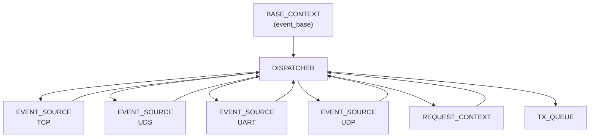

# **Dispatcher 기반 Event-Driven 통신 아키텍처 — 구조체 기술 문서**

본 문서는 EVENT_SOURCE + DISPATCHER 기반의 범용 FD 이벤트 처리 시스템에서
 사용되는 모든 핵심 구조체들의 정의, 역할, 관계, 그리고 전체 아키텍처 흐름을 설명한다.

이 시스템은 다음과 같은 요구 조건을 충족하기 위해 설계되었다:

- TCP / UDS / UDP / UART 등 다양한 FD 기반 입력을 하나의 구조로 통합
- Requester ↔ Worker 간 요청/응답 매칭
- 이벤트 기반 비동기 구조(libevent)
- 구조 확장성 (FD 추가 / Worker 수 증가)
- 모듈 간 책임 분리 및 재사용성 강화

------


# 1. BASE_CONTEXT

**프로그램 전체에서 공유되는 최상위 공용 컨텍스트**

------

## 목적

- libevent의 `event_base` 및 공용 이벤트(signal, timer 등)를 보관
- Dispatcher 및 EVENT_SOURCE가 참조할 시스템 레벨 리소스를 유지
- 사용자 정의 Context(UserCtx) 저장
- 프레임 통신 시 필요한 시스템 ID(MyId) 저장

------

## 구조체 정의

```c
typedef struct _BASE_CONTEXT {
    struct event_base*  pstEventBase;   /**< libevent 메인 루프 */
    struct event*       pstSignalEvent; /**< SIGINT/SIGTERM 처리 */
    struct event*       pstMainTimer;   /**< 정기 타이머 (옵션) */

    uint16_t            usMyId;         /**< 장비 ID 또는 프로세스 ID */
    void*               pvUserCtx;      /**< 사용자 정의 컨텍스트 */
} BASE_CONTEXT;
```

## 핵심 특징

- 프로그램 전체에서 **단 하나만 존재**
- Dispatcher는 BASE_CONTEXT를 통해 `event_base`에 접근
- EVENT_SOURCE는 `event_base`를 직접 가지지 않고 Dispatcher를 통해 간접 접근

------


# 2. EVENT_SOURCE

**하나의 FD(파일 서술자)를 대표하는 단일 객체**

------

## 목적

- FD에서 발생하는 READ/ERROR 이벤트를 event로 관리
- TCP/UDS/UART/UDP 등 다양한 FD 타입을 한 구조체로 통합 표현
- FD별 개별 Read/Event callback 제공
- Dispatcher와 연결되어 전체 관리 대상에 포함됨

------

## 구조체 정의

```c
typedef struct _EVENT_SOURCE {
    int iFd;                                /**< File Descriptor */
    struct bufferevent* pstBev;             /**< TCP/UDS용 bufferevent */
    struct event*       pstEvent;           /**< UDP/UART 등 raw FD 이벤트 */

    SRC_TYPE eType;                         /**< TCP / UDS / UDP / UART 등 */
    SRC_ROLE eRole;                         /**< REQUESTER / WORKER / NONE */

    READ_CB   pfOnRead;                     /**< read 콜백 */
    EVENT_CB  pfOnEvent;                    /**< error/EOF 콜백 */

    struct _EVENT_SOURCE* pstNext;          /**< Dispatcher의 연결 리스트 */
    DISPATCHER*            pstDispatcher;   /**< 소속 Dispatcher */
} EVENT_SOURCE;
```

## EVENT_SOURCE 생명주기 요약

1. FD 준비(socket/open/pipe)
2. `eventSourceCreateWithBev()` 또는 `eventSourceCreateWithFd()`
3. `dispatcherAttachSource()` 로 Dispatcher에 등록
4. event가 READ/ERROR 감지 → 등록된 콜백 호출
5. 종료 시 `eventSourceDestroy()`
    → FD close + bufferevent_free + Dispatcher 리스트 제거

------

## EVENT_SOURCE가 표현할 수 있는 FD 타입

| FD 종류              | EVENT_SOURCE 타입   |
| -------------------- | ------------------- |
| TCP client           | SRC_TYPE_TCP_CLIENT |
| TCP server accept FD | SRC_TYPE_TCP_CLIENT |
| UDS client           | SRC_TYPE_UDS_CLIENT |
| UDP socket           | SRC_TYPE_UDP        |
| UART device          | SRC_TYPE_UART       |
| file / pipe          | SRC_TYPE_FILE       |

------


# 3. DISPATCHER

**전체 FD 관리 + Request/Response 매칭을 처리하는 핵심 엔진**

------

## 목적

- 모든 EVENT_SOURCE를 하나의 리스트로 통합 관리
- RequestContext(Request ID 기반 구조)를 통한 요청/응답 매핑
- Requester → Worker 브로드캐스트 지원
- Worker 응답 집계 후 Requester에게 반환
- TxQueue를 이용한 비동기 송신 관리

------

## 구조체 정의

```c
typedef struct _DISPATCHER {
    BASE_CONTEXT*    pstBaseCtx;      /**< event_base 포함 */

    EVENT_SOURCE*    pstSources;      /**< 등록된 모든 EVENT_SOURCE */

    REQUEST_CONTEXT* pstReqList;      /**< 진행 중인 요청 리스트 */

    TX_QUEUE         stTxQueue;       /**< 송신 지연 큐 */
    struct event*    pstFlushEvent;   /**< TxQueue flush 이벤트 */
} DISPATCHER;
```

## Dispatcher 책임 영역

| 기능                | 설명                                     |
| ------------------- | ---------------------------------------- |
| EVENT_SOURCE 관리   | 등록/해제 및 전체 FD 목록 유지           |
| RequestContext 생성 | Request ID 발급, Worker 수 계산          |
| Worker 브로드캐스트 | 모든 Worker EVENT_SOURCE에게 요청 전달   |
| 응답 집계           | Worker 응답을 RequestContext 버퍼에 누적 |
| 송신 제어           | TxQueue를 통해 최종 Requester에게 전송   |

------


# 4. REQUEST_CONTEXT

**하나의 요청(Request)을 추적하고 응답을 집계하는 구조체**

------

## 목적

- Requester(예: TCP Client)와 Worker(예: UDS Worker) 간의 요청/응답 매칭
- Worker가 여러 명일 때 응답을 모두 모아 Requester에게 한 번에 반환
- 응답 타임아웃 관리

------

## 구조체 정의

```c
typedef struct _REQUEST_CONTEXT {
    uint32_t        unRequestId;      /**< Dispatcher가 부여한 Request ID */
    EVENT_SOURCE*   pstRequester;     /**< 요청자(EVENT_SOURCE) */

    int             iPending;         /**< 남은 Worker 응답 개수 */
    unsigned char   auchRespBuf[4096];/**< 응답 누적 버퍼 */
    int             iRespLen;         /**< 누적 응답 길이 */

    struct event*   pstTimeoutEvent;  /**< timeout 발생 시 cleanup */

    struct _REQUEST_CONTEXT* pstNext; /**< Dispatcher 리스트 next */
} REQUEST_CONTEXT;
```

## Request 흐름 단계

1. Requester 요청 수신
2. Request ID 발급
3. Worker 수만큼 iPending 설정
4. Worker들에게 브로드캐스트
5. Worker 응답 수신 → iPending--
6. iPending == 0 되면 Requester에게 최종 응답 전송
7. RequestContext 해제

------


# 5. TX_QUEUE

**송신의 일관성과 안정성을 보장하는 전용 큐**

------

## 목적

- 이벤트 기반 송신을 중앙화하여 Race condition 방지
- 여러 Worker 응답을 하나의 Requester에게 전달할 때 정합성을 유지
- flush 이벤트를 통해 송신 타이밍 제어

------

## 구조체 예시

```c
typedef struct _TX_QUEUE {
    unsigned char buf[4096];
    int len;
} TX_QUEUE;
```


# 6. 구조체 간 상호관계 요약

아키텍처 전체의 관계를 그림으로 표현하면 아래와 같다.




# 7. 전체 아키텍처 흐름 요약

### 1) FD 생성 → EVENT_SOURCE로 래핑

TCP/UDS/UART/UDP 모두 동일 API 사용.

### 2) Dispatcher에 Source 등록

```
dispatcherAttachSource()
```

### 3) 이벤트 발생 시

`pfOnRead()` 또는 `pfOnEvent()` 호출

### 4) Request는 Dispatcher에 의해 RequestId 기반 매칭

Worker 응답을 모두 모은 후 하나의 Response로 반환

### 5) 종료 시 EVENT_SOURCE Destroy

FD close + event_free

------


# 결론

이 문서에는 다음 내용이 완전하게 포함되어 있습니다:

- BASE_CONTEXT / EVENT_SOURCE / DISPATCHER / REQUEST_CONTEXT / TX_QUEUE
   **각 구조체의 정의와 목적**
- 구조체 간의 관계 (관계도 포함)
- Dispatcher Request–Response 동작 원리
- EVENT_SOURCE 생명주기
- FD 타입(TCP/UDS/UART/UDP)을 EVENT_SOURCE로 통합하는 방식